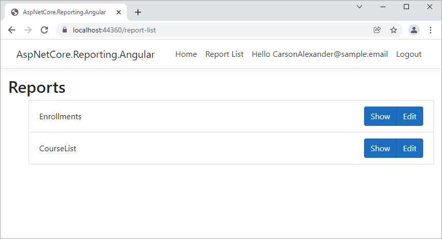

<!-- default badges list -->

[](https://supportcenter.devexpress.com/ticket/details/T939061)
[](https://docs.devexpress.com/GeneralInformation/403183)
[](#does-this-example-address-your-development-requirementsobjectives)
<!-- default badges end -->
# ASP.NET Core Reporting - Best Practices

## Introduction

This **README** file describes best practices to follow when you develop a web application with DevExpress reporting controls.

This repository also contains an example application that demonstrates the described techniques. This application is split into three projects:

- [ASP.NetCore.Reporting.MVC](AspNetCore.Reporting.MVC) - An ASP.Net Core MVC application.
- [ASP.NetCore.Reporting.Angular](AspNetCore.Reporting.Angular) - An ASP.Net Core application with an Angular frontend.
- [ASP.NetCore.Reporting.Common](AspNetCore.Reporting.Common) - Implements services and business logic for the MVC and Angular projects.

You can use the example code in your web application and modify it for different scenarios.

## Table of Contents:

- [How to Run the Example Application](#how-to-run-the-example-application)
  - [Configure NuGet](#configure-nuget)
  - [Install NPM Dependencies](#install-npm-dependencies)
  - [Start the Application](#start-the-application)
- [Switch to Asynchronous Mode](#switch-to-asynchronous-mode)
- [Optimize Memory Consumption](#optimize-memory-consumption)
- [Manage Database Connections](#manage-database-connections)
- [Application Security](#application-security)
  - [Prevent Cross-Site Request Forgery](#prevent-cross-site-request-forgery)
  - [Token-based Authentication](#token-based-authentication)
  - [Token-based Authentication in Angular](#token-based-authentication-in-angular)
  - [Implement User Authorization](#implement-user-authorization)
- [Handle Exceptions](#handle-exceptions)
  - [Log Errors that Occurred in the Code of DevExpress Reporting Components](#log-errors-that-occurred-in-the-code-of-devexpress-reporting-components)
  - [Use Custom Exception Handlers](#use-custom-exception-handlers)
- [Prepare Skeleton Screen](#prepare-skeleton-screen)
- [Localize Client UI](#localize-client-ui)

## How to Run the Example Application

Follow the steps below to run the example application in Microsoft Visual Studio.

### Configure NuGet

To run the example application, you need to install packages from the DevExpress NuGet feed. Use the following steps to configure NuGet:

1. [Obtain Your NuGet Feed URL](https://docs.devexpress.com/GeneralInformation/116042/installation/install-devexpress-controls-using-nuget-packages/obtain-your-nuget-feed-url)
2. [Register the NuGet feed as a package sources](https://docs.devexpress.com/GeneralInformation/116698/installation/install-devexpress-controls-using-nuget-packages/setup-visual-studios-nuget-package-manager)

### Install NPM Dependencies

- For the **ASP.NET Core MVC** project, run `npm install` in the project's root folder.
- For the **Angular** project, navigate to the **ClientApp** directory and run `npm install`.

### Start the Application

> **Note:** If you change the version of DevExpress NuGet packages used in the example application, make sure you also specify the matching minor versions for DevExpress client libraries in the **package.json** file.

Press the **Run** button or F5 to run the example application.




## Switch to Asynchronous Mode

Call the [UseAsyncEngine](https://docs.devexpress.com/XtraReports/DevExpress.AspNetCore.Reporting.ReportingConfigurationBuilder.UseAsyncEngine) method at application startup to use asynchronous counterparts of Reporting API interfaces and methods.

[ServiceRegistrator.cs](AspNetCore.Reporting.Common/Services/ServiceRegistrator.cs#L38)

```cs
services.ConfigureReportingServices(configurator => {
    // ...
    configurator.UseAsyncEngine();
});
```

If a reporting control binds to a report model (the [WebDocumentViewerModel](https://docs.devexpress.com/XtraReports/DevExpress.XtraReports.Web.WebDocumentViewer.WebDocumentViewerModel) instance), the reporting engine uses asynchronous API calls. You should generate a report model in the controller and pass the model to the Document Viewer.

If a reporting control is bound to a report instance or a string (report name), reporting engine does not use asynchronous methods and interfaces.
## Optimize Memory Consumption

This section describes how to optimize a reporting application's memory consumption, and prevent memory leaks and cluttering on the server.

> Refer to the [Document Viewer Lifecycle](https://docs.devexpress.com/XtraReports/401587/web-reporting/general-information/document-viewer-lifecycle) for information oh how the Document Viewer stores report data on different lifecycle stages.

To optimize memory consumption, use the following techniques:

- Configure the Document Viewer to store server data on disk instead of memory. This reduces the memory consumption at the cost of performance.

    [ServiceRegistrator.cs](AspNetCore.Reporting.Common/Services/ServiceRegistrator.cs#L29-L35)
    ```cs
    configurator.ConfigureWebDocumentViewer(viewerConfigurator => {
        // StorageSynchronizationMode.InterThread - it is a default value, use InterProcess if you use multiple application instances without ARR Affinity
        viewerConfigurator.UseFileDocumentStorage(Path.Combine(contentRootPath, "ViewerStorages\\Documents"), StorageSynchronizationMode.InterThread);
        viewerConfigurator.UseFileExportedDocumentStorage(Path.Combine(contentRootPath, "ViewerStorages\\ExportedDocuments"), StorageSynchronizationMode.InterThread);
        viewerConfigurator.UseFileReportStorage(Path.Combine(contentRootPath, "ViewerStorages\\Reports"), StorageSynchronizationMode.InterThread);
        viewerConfigurator.UseCachedReportSourceBuilder();
    });
    ```

- To allow users to close a page or a UI region (for example, a pop-up window) that displays the Document Viewer, you should first call the Document Viewer's client-side [Close](https://docs.devexpress.com/XtraReports/js-DevExpress.Reporting.Viewer.JSReportViewer?p=netframework#js_devexpress_reporting_viewer_jsreportviewer_close) method to close the viewed report and release the server resources (the Storage space and Cache):

    [DisplayReport.cshtml](AspNetCore.Reporting.MVC/Views/Home/DisplayReport.cshtml#L9)
    ```js
    function WebDocumentViewer_BeforeRender(s, e) {
    $(window).on('beforeunload', function(e) {
        s.Close();
    });
    ```

- Configure Storage and Cache cleaners on application startup. This allows you to specify how long you want to reserve resources to store document data on the server. Note that after a document's data is removed for the Storage and Cache, you cannot navigate or print this document.

    [ServiceRegistrator.cs](AspNetCore.Reporting.Common/Services/ServiceRegistrator.cs#L17-L21)


    ```csharp
    var cacheCleanerSettings = new CacheCleanerSettings(TimeSpan.FromMinutes(1), TimeSpan.FromSeconds(30), TimeSpan.FromMinutes(2), TimeSpan.FromMinutes(2));
    services.AddSingleton<CacheCleanerSettings>(cacheCleanerSettings);

    var storageCleanerSettings = new StorageCleanerSettings(TimeSpan.FromMinutes(5), TimeSpan.FromMinutes(30), TimeSpan.FromHours(12), TimeSpan.FromHours(12), TimeSpan.FromHours(12));
    services.AddSingleton<StorageCleanerSettings>(storageCleanerSettings);
    ```

  > Keep in mind that .NET is a managed environment, so data saved to the disk storage and removed from cache remains in memory until .NET runs garbage collection. Refer to the [Fundamentals of garbage collection](https://docs.microsoft.com/en-us/dotnet/standard/garbage-collection/fundamentals) article for more information.

## Manage Database Connections

DevExpress reporting components are configured to retrieve database connections from the application configuration file. This mechanism is secure: a serialized report contains only the connection name. If you implement a custom connection provider to customize this mechanism (for example, to filter the list of connections), ensure you serialize only the data connection's name and do not pass connection parameters to the client.

Reporting services obtain an [IConnectionProviderFactory](https://docs.devexpress.com/CoreLibraries/DevExpress.DataAccess.Web.IConnectionProviderFactory) and [IDataSourceWizardConnectionStringsProvider](https://docs.devexpress.com/CoreLibraries/DevExpress.DataAccess.Web.IDataSourceWizardConnectionStringsProvider) interfaces through Dependency Injection. For instructions on how to implement these services, refer to the following example project's files:

- [Services/Reporting/CustomSqlDataConnectionProviderFactory.cs](AspNetCore.Reporting.Common/Services/Reporting/CustomSqlDataConnectionProviderFactory.cs)
- [Services/Reporting/CustomSqlDataSourceWizardConnectionStringsProvider.cs](AspNetCore.Reporting.Common/Services/Reporting/CustomSqlDataSourceWizardConnectionStringsProvider.cs)

To ensure that encrypted connection parameters for SqlDataSource instances are not passed to the client, return `null` from the `IDataSourceWizardConnectionStringsProvider.GetDataConnectionParameters` method's implementation:

[CustomSqlDataSourceWizardConnectionStringsProvider.cs](AspNetCore.Reporting.Common/Services/Reporting/CustomSqlDataSourceWizardConnectionStringsProvider.cs#L18-L20)

```csharp
public DataConnectionParametersBase GetDataConnectionParameters(string name) {
    return null;//to prevent serialization of encrypted connection parameters
}
```

In the [IConnectionProviderService](https://docs.devexpress.com/CoreLibraries/DevExpress.DataAccess.Wizard.Services.IConnectionProviderService) interface returned by the IConnectionProviderFactory, initialize and return the connection.

[CustomSqlDataConnectionProviderFactory.cs](AspNetCore.Reporting.Common/Services/Reporting/CustomSqlDataConnectionProviderFactory.cs#L31-L42)

```csharp
public SqlDataConnection LoadConnection(string connectionName) {
    var connectionStringSection = configuration.GetSection("ReportingDataConnectionStrings");
    var connectionString = connectionStringSection?.GetValue<string>(connectionName);
    var connectionStringInfo = new ConnectionStringInfo { RunTimeConnectionString = connectionString, ProviderName = "SQLite" };
    DataConnectionParametersBase connectionParameters;
    if(string.IsNullOrEmpty(connectionString)
        || !AppConfigHelper.TryCreateSqlConnectionParameters(connectionStringInfo, out connectionParameters)
        || connectionParameters == null) {
        throw new KeyNotFoundException($"Connection string '{connectionName}' not found.");
    }
    return new SqlDataConnection(connectionName, connectionParameters);
}
```

Register the implemented services in [Startup.cs](AspNetCore.Reporting.MVC/Startup.cs).

## Application Security

### Prevent Cross-Site Request Forgery

To prevent cross-site request forgery, DevExpress reporting controls use the standard ASP.NET Core mechanism described in the following articles:

##### Microsoft Documentation:

- [Prevent Cross-Site Request Forgery (XSRF/CSRF) attacks in ASP.NET Core](https://docs.microsoft.com/en-us/aspnet/core/security/anti-request-forgery).

##### DevExpress Security Best Practices:

- [ASP.NET WebForms - Preventing Cross-Site Request Forgery (CSRF)](https://github.com/DevExpress/aspnet-security-bestpractices/tree/master/SecurityBestPractices.WebForms#4-preventing-cross-site-request-forgery-csrf)
- [ASP.NET MVC - Preventing Cross-Site Request Forgery (CSRF)](https://github.com/DevExpress/aspnet-security-bestpractices/tree/master/SecurityBestPractices.Mvc#4-preventing-cross-site-request-forgery-csrf)

The following code samples demonstrate how to apply antiforgery request validation on the Document Viewer's and Report Designer's controller actions.

##### Document Viewer

[CustomMVCReportingControllers.cs](AspNetCore.Reporting.MVC/Controllers/CustomMVCReportingControllers.cs#L14-L22)

```csharp
[AutoValidateAntiforgeryToken]
public class CustomMVCWebDocumentViewerController : WebDocumentViewerController {
    public CustomMVCWebDocumentViewerController(IWebDocumentViewerMvcControllerService controllerService) : base(controllerService) {
    }

    public override Task<IActionResult> Invoke() {
        return base.Invoke();
    }
}
```

##### Report Designer

[CustomMVCReportingControllers.cs](AspNetCore.Reporting.MVC/Controllers/CustomMVCReportingControllers.cs#L24-L46)


```cs
[AutoValidateAntiforgeryToken]
public class CustomMVCQueryBuilderController : QueryBuilderController {
    public CustomMVCQueryBuilderController(IQueryBuilderMvcControllerService controllerService) : base(controllerService) {
    }
    public override Task<IActionResult> Invoke() {
        return base.Invoke();
    }
}


[AutoValidateAntiforgeryToken]
public class CustomMVCReportDesignerController : ReportDesignerController {
    public CustomMVCReportDesignerController(IReportDesignerMvcControllerService controllerService) : base(controllerService) {
    }
    
    public override Task<IActionResult> Invoke() {
        return base.Invoke();
    }
}
```

### Token-based Authentication

The following code snippet shows how to pass the access token:
[site.js](AspNetCore.Reporting.MVC/wwwroot/js/site.js)

```js
function SetupJwt(bearerToken, xsrf) {
    DevExpress.Analytics.Utils.fetchSetup.fetchSettings = {
        headers: {
            //'Authorization': 'Bearer ' + bearerToken,
            'RequestVerificationToken': xsrf
        }
    }; 
}
```

[DisplayReport.cshtml](AspNetCore.Reporting.MVC/Views/Home/DisplayReport.cshtml#L5-L7)

```cshtml
@inject Microsoft.AspNetCore.Antiforgery.IAntiforgery Xsrf
@functions{ public string GetAntiXsrfRequestToken() {
                return Xsrf.GetAndStoreTokens(this.Context).RequestToken;
            } }
```

[DisplayReport.cshtml](AspNetCore.Reporting.MVC/Views/Home/DisplayReport.cshtml#L9-L18)


```js
function WebDocumentViewer_BeforeRender(s, e) {
    SetupJwt('bearer token can be passed here', "@GetAntiXsrfRequestToken()");
    $(window).on('beforeunload', function(e) {
        s.Close();
    });
}
```
[DisplayReport.cshtml](AspNetCore.Reporting.MVC/Views/Home/DisplayReport.cshtml#L33)

```html
<input type="hidden" id="RequestVerificationToken" name="RequestVerificationToken" value="@GetAntiXsrfRequestToken()">
@{ var viewerRender = Html.DevExpress().WebDocumentViewer("DocumentViewer")
        .ClientSideEvents(x => {
            // ...
            x.BeforeRender("WebDocumentViewer_BeforeRender");
        })
    // ...
    .Height("900px")
    .HandlerUri("/DXXRDVMVC")
    .Bind(Model.Id);
    @:@viewerRender.RenderHtml()
}
```

Review the project's [Views/Home/DesignReport.cshtml](AspNetCore.Reporting.MVC/Views/Home/DesignReport.cshtml) or [Views/Home/DisplayReport.cshtml](AspNetCore.Reporting.MVC/Views/Home/DisplayReport.cshtml) files for the full code.

### Token-based Authentication in Angular

The following code snippet shows how to pass the access token in an Angular application:

[report-viewer.ts](AspNetCore.Reporting.Angular/ClientApp/src/app/reportviewer/report-viewer.ts#L30-L48)

```typescript
import { AuthorizeService } from '../../api-authorization/authorize.service';
// ...
  useSameTabExport = true;
  useAsynchronousExport = true;

  constructor(@Inject('BASE_URL') public hostUrl: string, private authorize: AuthorizeService, private activateRoute: ActivatedRoute) {
    this.authorize.getAccessToken()
      .subscribe(x => {
        fetchSetup.fetchSettings = {
          headers: {
            'Authorization': 'Bearer ' + x
          }
        };
      });
  }
  // ...
```
Review the report viewer's files ([report-viewer.html](AspNetCore.Reporting.Angular/ClientApp/src/app/reportviewer/report-viewer.html) and [report-viewer.ts](AspNetCore.Reporting.Angular/ClientApp/src/app/reportviewer/report-viewer.ts)) or the report designer's files ([report-designer.html](AspNetCore.Reporting.Angular/ClientApp/src/app/reportdesigner/report-designer.html) and [report-designer.ts](AspNetCore.Reporting.Angular/ClientApp/src/app/reportdesigner/report-designer.ts)) for the full code.
### Implement User Authorization

To authorize a user and restrict access to reports based on arbitrary logic, implement and register an [IWebDocumentViewerAuthorizationService](https://docs.devexpress.com/XtraReports/DevExpress.XtraReports.Web.WebDocumentViewer.IWebDocumentViewerAuthorizationService) with [WebDocumentViewerOperationLogger](https://docs.devexpress.com/XtraReports/DevExpress.XtraReports.Web.WebDocumentViewer.WebDocumentViewerOperationLogger).

You can also implement an `DevExpress.XtraReports.Web.WebDocumentViewer.IExportedDocumentStorage` to prevent unauthorized access to documents generated during asynchronous export and printing operations.

[DocumentViewerAuthorizationService.cs](AspNetCore.Reporting.Common/Services/Reporting/DocumentViewerAuthorizationService.cs):

```csharp
class DocumentViewerAuthorizationService : WebDocumentViewerOperationLogger, IWebDocumentViewerAuthorizationService, IExportingAuthorizationService {
    static ConcurrentDictionary<string, string> DocumentIdOwnerMap { get; } = new ConcurrentDictionary<string, string>();
    static ConcurrentDictionary<string, string> ExportedDocumentIdOwnerMap { get; } = new ConcurrentDictionary<string, string>();
    static ConcurrentDictionary<string, string> ReportIdOwnerMap { get; } = new ConcurrentDictionary<string, string>();

    IAuthenticatiedUserService UserService { get; }

    public DocumentViewerAuthorizationService(IAuthenticatiedUserService userService) {
        UserService = userService ?? throw new ArgumentNullException(nameof(userService));
    }

    public override void ReportOpening(string reportId, string documentId, XtraReport report) {
        MapIdentifiersToUser(UserService.GetCurrentUserId(), documentId, reportId, null);
        base.ReportOpening(reportId, documentId, report);
    }

    public override void BuildStarted(string reportId, string documentId, ReportBuildProperties buildProperties) {
        MapIdentifiersToUser(UserService.GetCurrentUserId(), documentId, reportId, null);
        base.BuildStarted(reportId, documentId, buildProperties);
    }

    public override ExportedDocument ExportDocumentStarting(string documentId, string asyncExportOperationId, string format, ExportOptions options, PrintingSystemBase printingSystem, Func<ExportedDocument> doExportSynchronously) {
        MapIdentifiersToUser(UserService.GetCurrentUserId(), null, null, asyncExportOperationId);
        return base.ExportDocumentStarting(documentId, asyncExportOperationId, format, options, printingSystem, doExportSynchronously);
    }

    void MapIdentifiersToUser(string userId, string documentId, string reportId, string exportedDocumentId) {
        if(!string.IsNullOrEmpty(exportedDocumentId))
            ExportedDocumentIdOwnerMap.TryAdd(exportedDocumentId, userId);

        if(!string.IsNullOrEmpty(documentId)) 
            DocumentIdOwnerMap.TryAdd(documentId, userId);

        if(!string.IsNullOrEmpty(reportId)) 
            ReportIdOwnerMap.TryAdd(reportId, userId);

    }

    #region IWebDocumentViewerAuthorizationService
    public bool CanCreateDocument() {
        return true;
    }

    public bool CanCreateReport() {
        return true;
    }

    public bool CanReadDocument(string documentId) {
        return DocumentIdOwnerMap.TryGetValue(documentId, out var ownerId) && ownerId == UserService.GetCurrentUserId();
    }

    public bool CanReadReport(string reportId) {
        return ReportIdOwnerMap.TryGetValue(reportId, out var ownerId) && ownerId == UserService.GetCurrentUserId();
    }

    public bool CanReleaseDocument(string documentId) {
        return true;
    }

    public bool CanReleaseReport(string reportId) {
        return true;
    }

    public bool CanReadExportedDocument(string exportedDocumentId) {
        return ExportedDocumentIdOwnerMap.TryGetValue(exportedDocumentId, out var ownerId) && ownerId == UserService.GetCurrentUserId();
    }
    #endregion
}
```

Register your authorization service implementation at application startup. In this example the `ConfigureServices` method uses a custom `ServiceRegistrator` class to register services specific to web reporting.

[Startup.cs](AspNetCore.Reporting.MVC/Startup.cs#L47):

```cs
public class Startup {
    public void ConfigureServices(IServiceCollection services) {
        ...
        ServiceRegistrator.AddCommonServices(services, WebHostEnvironment.ContentRootPath);
        ...
    }
    ...
}
```
[ServiceRegistrator.cs](AspNetCore.Reporting.Common/Services/ServiceRegistrator.cs#L46-L48):
```cs
public class ServiceRegistrator {
    public static IServiceCollection AddCommonServices(IServiceCollection services) {
        // ...
        services.AddScoped<IWebDocumentViewerAuthorizationService, DocumentViewerAuthorizationService>();
        services.AddScoped<IExportingAuthorizationService, DocumentViewerAuthorizationService>();
        services.AddScoped<WebDocumentViewerOperationLogger, DocumentViewerAuthorizationService>();

        // ...
    }
}
```

## Handle Exceptions

This document section describes the best practices that you should follow when you handle and log errors in a reporting application. For information on how to determine the cause of a problem with your application, refer to the [Reporting Application Diagnostics](https://docs.devexpress.com/XtraReports/401687/web-reporting/general-information/application-diagnostics) documentation topic.

### Log Errors that Occurred in the Code of DevExpress Reporting Components

To handle exceptions generated by DevExpress reporting components, implement and register a logger service and override the `Error` method in your service implementation. In the `Error` method's implementation, save errors to a log or database. If a Visual Studio debugger is attached, you can set a breakpoint and inspect errors in the Watch window.

##### Implement a Logger Class

[ReportingLoggerService.cs](AspNetCore.Reporting.Common/Services/Reporting/ReportingLoggerService.cs):

```csharp
public class ReportingLoggerService: LoggerService {
    readonly ILogger logger;
    public ReportingLoggerService(ILogger logger) {
        this.logger = logger;
    }
    public override void Error(Exception exception, string message) {
        var logMessage = $"[{DateTime.Now}]: Exception occurred. Message: '{message}'. Exception Details:\r\n{exception}";
        logger.LogError(logMessage);
    }

    public override void Info(string message) {
        logger.LogInformation(message);
    }
}
```

##### Register the Logger in **Startup.cs**

[Startup.cs](AspNetCore.Reporting.MVC/Startup.cs#L70):

```cs
LoggerService.Initialize(new CustomReportingLoggerService(loggerFactory.CreateLogger("DXReporting")));
```

### Use Custom Exception Handlers

Use custom exception handler services to customize error details that are passed to the client and displayed in the client UI:

```csharp
public class CustomWebDocumentViewerExceptionHandler : WebDocumentViewerExceptionHandler {
    public override string GetExceptionMessage(Exception ex) {
        if(ex is FileNotFoundException) {
#if DEBUG
            return ex.Message;
#else
            return "File is not found.";
#endif
        }
        return base.GetExceptionMessage(ex);
    }
    public override string GetUnknownExceptionMessage(Exception ex) {
        return $"{ex.GetType().Name} occurred. See the log file for more details.";
    }
}
```

Refer to the example project's [Services/Reporting/CustomExceptionHandlers.cs](AspNetCore.Reporting.Common/Services/Reporting/CustomExceptionHandlers.cs) file for the full code.

## Prepare Skeleton Screen

This section describes how to implement a skeleton screen that indicates when the application is being loaded. With this approach, the client first displays a mock screen that mimics the application's layout and then proceeds to load the resources for the reporting components.


Use the following steps to prepare a skeleton screen:

In [_Layout.cshtml](AspNetCore.Reporting.MVC/Views/Shared/_Layout.cshtml), move all the `script` elements to the bottom of the layout:

```cs
...
    <footer class="border-top footer text-muted">
        <div class="container">
            &copy; 2021 - AspNetCore.Reporting.MVC - <a asp-area="" asp-controller="Home" asp-action="Privacy">Privacy</a>
        </div>
    </footer>
    <script src="~/js/site.thirdparty.bundle.js"></script>
    <script src="~/js/site.js" asp-append-version="true"></script>
    @RenderSection("Scripts", required: false)
</body>
</html>
```

In a view, add the `dx-reporting-skeleton-screen.css` file from the **devexpress-reporting** NPM package to the page that contains the Report Designer and render two separate parts of the reporting control:

- Call the `RenderHtml()` method to render markup.
- Call the `RenderScripts()` method to render scripts.

[DesignReport.cshtml](AspNetCore.Reporting.MVC/Views/Home/DesignReport.cshtml):

```cs
@{
    var designerRender = Html.DevExpress().ReportDesigner("ReportDesigner").Height("800px").Bind(Model.Id);//you can set another options here
    @:@designerRender.GetHtml()
}

...

@section Scripts {
    <link href="~/css/dx-reporting-skeleton-screen.css" rel="stylesheet" />
    <link rel="stylesheet" href="~/css/viewer.part.bundle.css" />
    <link rel="stylesheet" href="~/css/designer.part.bundle.css" />

    <script src="~/js/reporting.thirdparty.bundle.js"></script>
    <script src="~/js/viewer.part.bundle.js"></script>
    <script src="~/js/designer.part.bundle.js"></script>
    @designerRender.RenderScripts()
}
```

Refer to the [Enable the Skeleton Screen](https://docs.devexpress.com/XtraReports/401830/web-reporting/asp-net-core-reporting/end-user-report-designer/customization/enable-skeleton-screen) article for more information.

## Localize Client UI

DevExpress client reporting controls use the DevExtreme localization mechanism to localize the UI and messages.

To localize DevExpress reporting controls, go to [localization.devexpress.com](https://localization.devexpress.com/), download the JSON files for the localization, and save them to the `locaization` folder within the application's `wwwroot` folder. After that, configure the view as described below:

1. In the client `CustomizeLocalization` event, load the localization JSON files:

[DesignReport.cshtml](AspNetCore.Reporting.MVC/Views/Home/DesignReport.cshtml#L27-L32)

```js
function CustomizeLocalization(s, e){
    //obtain these files from the Localization Service and then uncomment this code
    //e.LoadMessages($.get("/localization/reporting/dx-analytics-core.de.json"));
    //e.LoadMessages($.get("/localization/reporting/dx-reporting.de.json"));
    e.LoadMessages($.get("/localization/devextreme/de.json").done(function(messages) { DevExpress.localization.loadMessages(messages); }));
    e.SetAvailableCultures(["de"]);
}
```

2. Set the `IncludeLocalization` option to `false` to disable automatic attachment of the localization dictionary:

[DesignReport.cshtml](AspNetCore.Reporting.MVC/Views/Home/DesignReport.cshtml#L44-L46):

```cs
    Html.DevExpress().ReportDesigner("ReportDesigner")
        .ClientSideModelSettings(clientSide => {
            clientSide.IncludeLocalization = false;
        })
        ...
```

A translation does not always cover all the possible strings. You can use the localization service's UI to add the missing strings as described in the [Localization Service](https://docs.devexpress.com/LocalizationService/16235/localization-service) article.

For a full code example, refer to the example project's [Views/Home/DesignReport.cshtml](AspNetCore.Reporting.MVC/Views/Home/DesignReport.cshtml) or [Views/Home/DisplayReport.cshtml](AspNetCore.Reporting.MVC/Views/Home/DisplayReport.cshtml).
<!-- feedback -->
## Does this example address your development requirements/objectives?

[](https://www.devexpress.com/support/examples/survey.xml?utm_source=github&utm_campaign=AspNetCore.Reporting.BestPractices&~~~was_helpful=yes) [](https://www.devexpress.com/support/examples/survey.xml?utm_source=github&utm_campaign=AspNetCore.Reporting.BestPractices&~~~was_helpful=no)

(you will be redirected to DevExpress.com to submit your response)
<!-- feedback end -->
